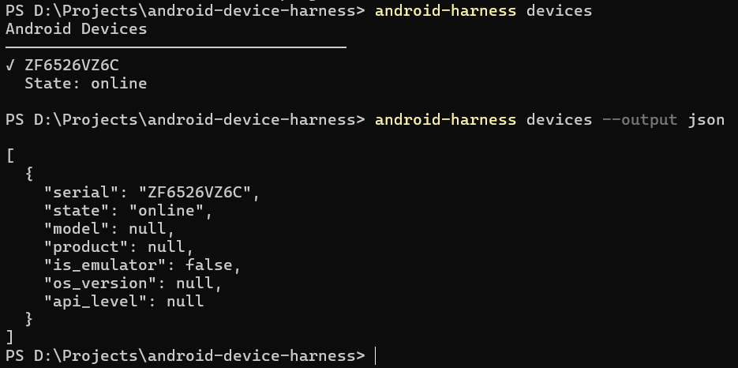
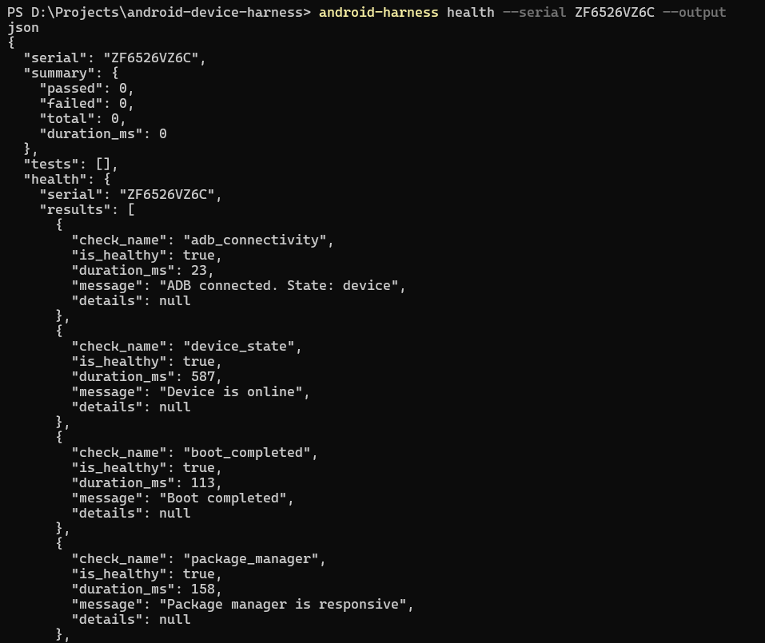
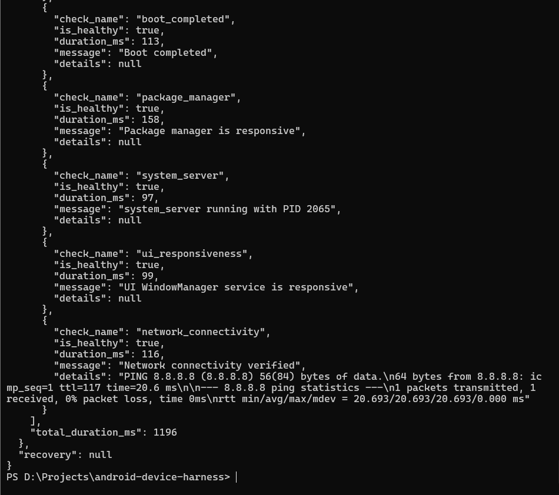
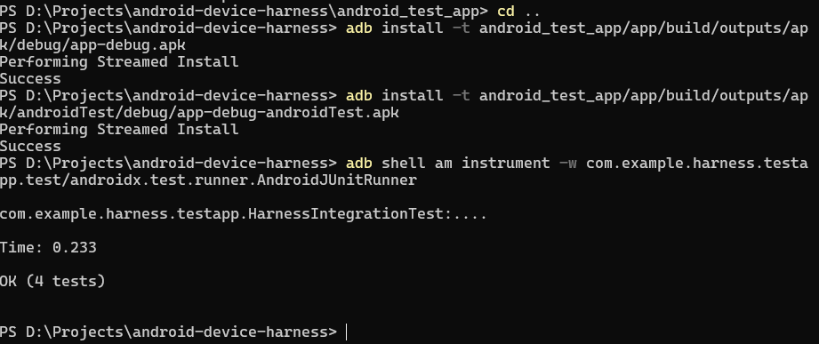
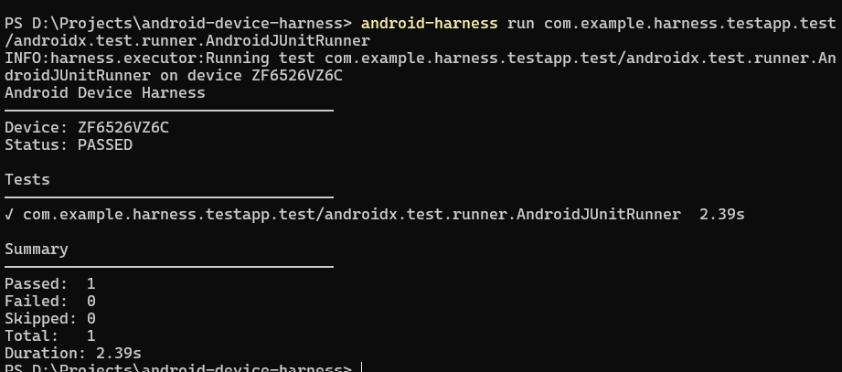
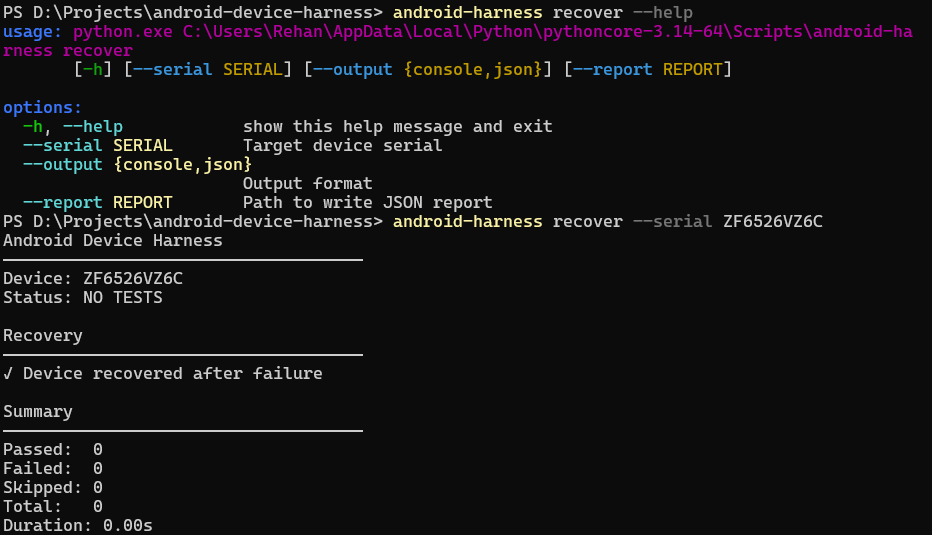
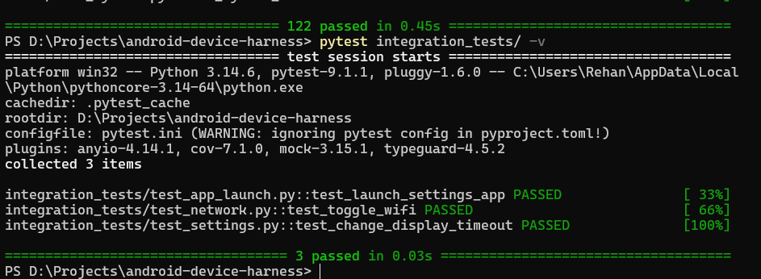
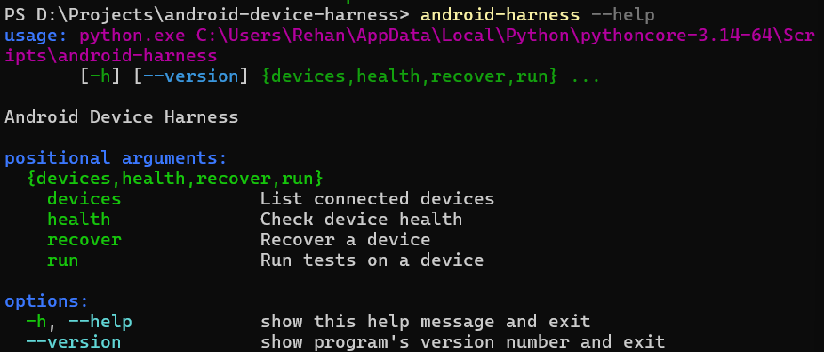

# Android Device Harness

An automated Android device test execution and health-recovery framework built to demonstrate SDET / Android Device Quality Engineering skills.

The project provides a modular Python-based harness for:

- Android device discovery
- Device health monitoring
- Automated recovery
- Android instrumentation test execution
- Structured test reporting
- CLI-based workflows
- Unit and integration testing
- CI-ready architecture

## Architecture

The framework is organized into focused, testable components:

- **ADB Wrapper (`harness.adb`)** - Centralized interaction with the Android Debug Bridge.
- **Device Management (`harness.device`)** - Discovers and models connected Android devices and emulators.
- **Health Checking (`harness.health`)** - Validates device readiness and operational health.
- **Recovery (`harness.recovery`)** - Provides recovery strategies for unhealthy or unresponsive devices.
- **Execution (`harness.executor`)** - Executes Android instrumentation tests against target devices.
- **Reporting (`harness.reporter`)** - Produces structured test and health reports.
- **CLI (`harness.cli`)** - Provides a clean command-line interface for device and test operations.

## Project Structure

```text
android-device-harness/
|
+-- harness/
|   +-- adb.py
|   +-- device.py
|   +-- health.py
|   +-- recovery.py
|   +-- executor.py
|   +-- reporter.py
|   +-- cli.py
|
+-- android_test_app/
|   +-- app/
|   +-- gradle/
|   +-- gradlew
|
+-- tests/
+-- integration_tests/
+-- manual_artifacts/
+-- .github/workflows/
|
+-- pyproject.toml
+-- pytest.ini
+-- README.md
+-- LICENSE
```

## Requirements

- Python 3.11+
- Android SDK Platform-Tools
- `adb` available in the system PATH
- Java JDK for building the Android test target
- Android SDK with the required platform/build-tools packages
- Android device or emulator with USB debugging enabled

## Installation

Clone the repository:

```bash
git clone <repo-url>
cd android-device-harness
```

Create a Python virtual environment:

```bash
python -m venv venv
```

Activate it on Windows:

```powershell
venv\Scripts\activate
```

Install the project:

```powershell
pip install -e ".[dev]"
```

Verify the CLI:

```powershell
android-harness --help
```

## CLI Usage

The `android-harness` command provides a single interface for device discovery, health checks, recovery, and test execution.

### List Devices

```powershell
android-harness devices
```

Example:

```text
Android Devices
------------------------------------
[OK] ZF6526VZ6C
    State: online
```

JSON output is also supported:

```powershell
android-harness devices --output json
```

### Check Device Health

```powershell
android-harness health --serial ZF6526VZ6C
```

JSON reports can be written to a file:

```powershell
android-harness health --serial ZF6526VZ6C --output json --report health-report.json
```

The health subsystem checks:

- ADB connectivity
- Device state
- Boot completion
- Package manager responsiveness
- System server
- UI responsiveness
- Network connectivity

### Recover a Device

```powershell
android-harness recover --serial ZF6526VZ6C
```

The recovery subsystem can attempt to restore an unhealthy or unresponsive device to an operational state.

### Run Android Tests

```powershell
android-harness run <test-target>
```

Example:

```powershell
android-harness run com.example.harness.testapp.test/androidx.test.runner.AndroidJUnitRunner
```

## Android Test Target

The repository contains a minimal Android instrumentation test application under:

```text
android_test_app/
```

### Build

From the `android_test_app` directory:

```powershell
.\gradlew assembleDebug assembleDebugAndroidTest
```

The build produces:

```text
app/build/outputs/apk/debug/app-debug.apk
app/build/outputs/apk/androidTest/debug/app-debug-androidTest.apk
```

### Install

From the repository root:

```powershell
adb install -t android_test_app/app/build/outputs/apk/debug/app-debug.apk
```

```powershell
adb install -t android_test_app/app/build/outputs/apk/androidTest/debug/app-debug-androidTest.apk
```

### Run Instrumentation Tests Directly

```powershell
adb shell am instrument -w com.example.harness.testapp.test/androidx.test.runner.AndroidJUnitRunner
```

Manual verification produced:

```text
OK (4 tests)
```

## Testing

### Unit Tests

Unit tests mock ADB interactions and can run without a physical Android device:

```powershell
pytest tests/
```

### Integration Tests

Integration tests validate real device interactions:

```powershell
pytest integration_tests/ -v
```

Manual verification produced:

```text
3 passed
```

## Manual Verification

The framework was manually validated against a connected Android device.

### 1. Device Discovery

The harness successfully detected the connected Android device and reported it as online.



### 2. Device Health

The health subsystem successfully verified:

- ADB connectivity
- Device state
- Boot completion
- Package manager responsiveness
- System server
- UI responsiveness
- Network connectivity






### 3. Android Instrumentation Tests

The Android test target was successfully built, installed, and executed directly through ADB.

Result:

```text
OK (4 tests)
```



### 4. Harness Test Execution

The same Android instrumentation target was executed through the `android-harness` CLI.

Result:

```text
Status: PASSED

Passed: 1
Failed: 0
Skipped: 0
Total: 1
Duration: 2.39s
```



### 5. Device Recovery

The recovery workflow was manually executed against the connected device.

Result:

```text
Device recovered after failure
```



### 6. Integration Tests

The integration test suite was manually executed against the connected Android device.

Result:

```text
3 passed in 0.03s
```



### 7. CLI Interface

The CLI exposes the primary framework operations:

```text
devices
health
recover
run
```



## Example Health Report

The framework generates structured JSON health reports containing:

- Target device serial
- Individual health-check results
- Health status
- Execution duration
- Diagnostic messages
- Recovery information

Example structure:

```json
{
  "serial": "ZF6526VZ6C",
  "summary": {
    "passed": 0,
    "failed": 0,
    "total": 0
  },
  "health": {
    "serial": "ZF6526VZ6C",
    "results": [
      {
        "check_name": "adb_connectivity",
        "is_healthy": true
      },
      {
        "check_name": "device_state",
        "is_healthy": true
      },
      {
        "check_name": "boot_completed",
        "is_healthy": true
      },
      {
        "check_name": "package_manager",
        "is_healthy": true
      },
      {
        "check_name": "system_server",
        "is_healthy": true
      },
      {
        "check_name": "ui_responsiveness",
        "is_healthy": true
      },
      {
        "check_name": "network_connectivity",
        "is_healthy": true
      }
    ]
  },
  "recovery": null
}
```

The actual manually generated report is included in:

```text
health-report.json
```

## Engineering Focus

This project demonstrates practical Android SDET / Device Quality Engineering concepts:

- ADB automation
- Android instrumentation testing
- Device health monitoring
- Device recovery workflows
- Python CLI development
- Modular architecture
- Unit and integration testing
- Structured JSON reporting
- Error handling and timeouts
- Testability through dependency isolation
- CI-oriented project structure

## Verification Summary

| Area | Result |
|---|---|
| Android build | PASS |
| APK installation | PASS |
| Android instrumentation tests | 4 tests passed |
| Harness test execution | PASS |
| Device discovery | PASS |
| Device health checks | PASS |
| Device recovery workflow | PASS |
| Integration tests | 3 passed |
| CLI interface | PASS |

## License

This project is licensed under the MIT License.